# How mapsnap places a Sanborn sheet

_This doc was generated by an LLM from the code, the run archives and the PR
history. Figures are rendered from a real run by
`scripts/how_it_works_figures.py`; nothing is a mock-up._

The pipeline in fifteen steps, following one volume: **Columbus, Ohio, 1951,
vol. 3** (106 pages, 105 with hand-placed truth), as it ran in the
`2026-09-03` corpus baseline. One step borrows a page from Richmond 1925 vol. 3,
because Columbus has no snap rescue as clear as Richmond's p311.

Two companion documents carry the detail this page skips: `docs/fit-pipeline.md`
lists every gate a page can fail and the message it leaves behind, and
`docs/baseline.md` says how a corpus run is made and scored. Each step below
names the pull requests that built it; they carry the experiments and pictures
behind the design.


The first seven stages run once per volume and cache their sidecars beside the
page images; `mapsnap fit` runs the last seven in a fixed order (#270 phase 3),
each communicating with the next through per-page sidecar files
(`p220.streets.json`, `p220.georef.json`, `p220.georef-final.json`, …).

---

## I. The inputs

### 1. A sheet, and the key map that indexes it

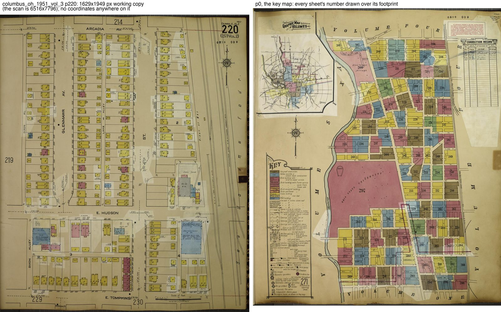

A Sanborn sheet is exact about buildings and silent about where it is. There
is a compass rose, a scale bar and a page number, but no coordinates. What the
volume does carry is a **key map**: one sheet drawn at a coarser scale with
every page number printed over the area that page covers. mapsnap reads both.

Pages arrive as scans from the Library of Congress IIIF service (#33, #86) or
from OldInsuranceMaps.net (#310, which also fetches the hand-placed
truth). Everything downstream works on a 25% copy (here 1629 × 1949 px); only
the key map keeps its full-resolution scan under `raw/`, because its page
numbers are small.

|  |  |
| --- | --- |
| Volume | Columbus, Ohio, 1951, vol. 3 |
| Pages | 106 (99 placed by this run; 105 have truth) |
| Working copy | 1629 × 1949 px, one quarter of the scan |

### 2. One scan, several pages

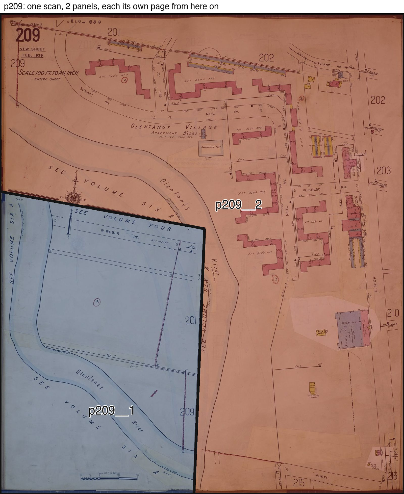

Many sheets carry two to four separate map panels divided by heavy black rules,
often L-shaped or stepped. `mapsnap split` vectorizes the rules, cuts the sheet
into panels and writes each as its own page (`p209__1`, `p209__2`) with the
out-of-panel area masked white (#70; the OIM-truth harness and shape guard of
#272). Two-panel sheets number the panel holding the bottom-left corner first,
matching OldInsuranceMaps (#382), so truth and output name the same panel.

Key-map sheets get a second, stricter look: a split must cut away a box flush
with two sheet edges, or the parent stands whole (#383), and a corner-box
detector finds the lightly ruled legends and volume indexes the general
splitter's safety gate hides (#389). Sidecars of any panel whose outline
changed are deleted so nothing stale survives a re-split (#382).

|  |  |
| --- | --- |
| Split sheets in this volume | 8 (p201, p202, p206, p209, p221, p241, p243, p248) |
| Panels | 16 |

---

## II. Reading the sheet

### 3. Where the text is

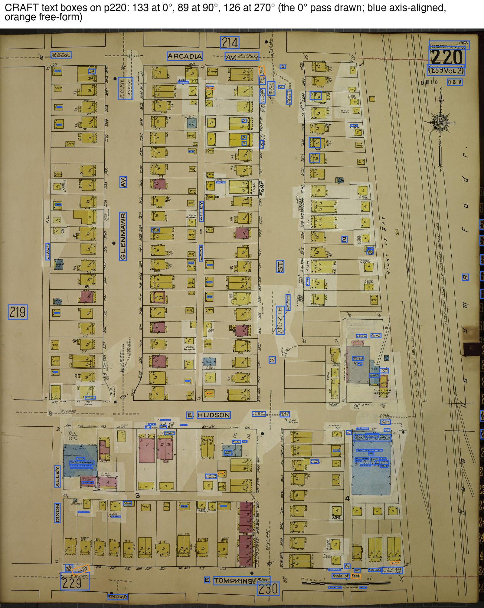

The only model that looks at the whole drawing is a text *detector*: EasyOCR's
CRAFT, run three times on each page, on the image as scanned and rotated by 90°
and 270°, because street names run in every direction. Detection is tiled so
small type on a large sheet is not lost (#101), runs as its own cached step
(#216), and a split panel inherits its parent sheet's boxes, remapped into the
panel's frame, instead of being detected twice (#362, #394).

|  |  |
| --- | --- |
| Boxes on p220 | 133 at 0°, 89 at 90°, 126 at 270° |

### 4. Reading only what could be a street

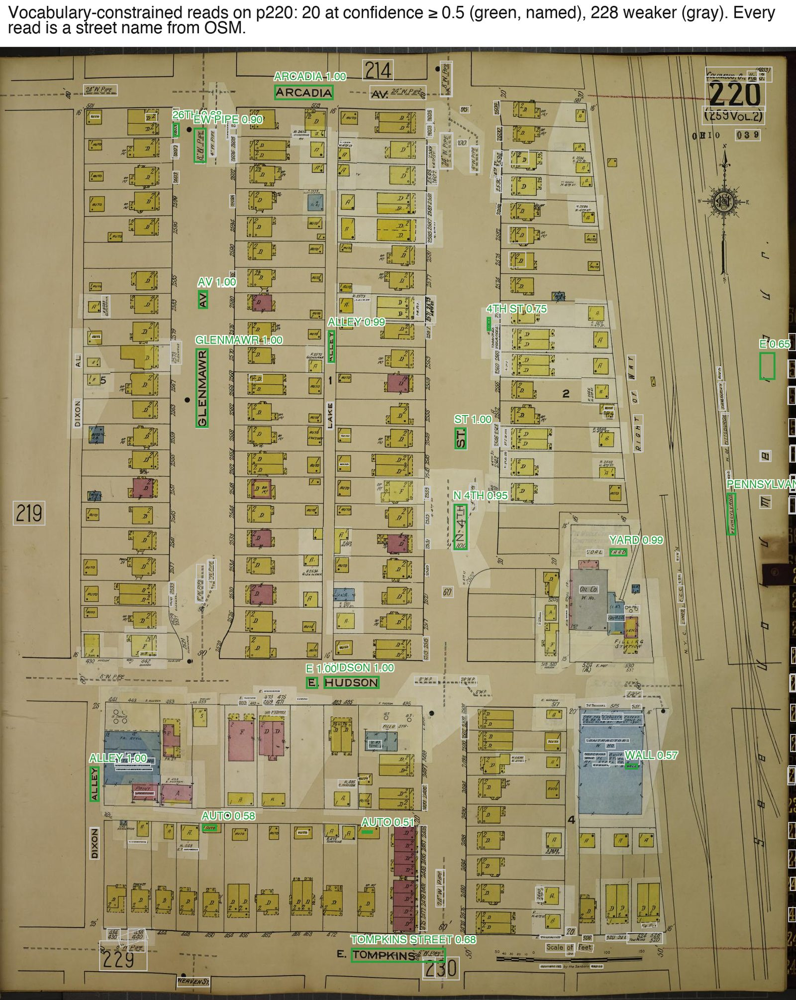

Each box is read by a CRNN recognizer fine-tuned on Sanborn lettering (#279,
#313). The trick is in the decoder: instead of free text, the CTC decoder walks
a **prefix trie of street names** taken from OpenStreetMap, so every read is by
construction a name that exists near the page (#18; lettered avenues and
type hints like `ST` / `AV` in #46; spelling variants that keep the stem, so
`CLAIREPOINTE` finds `CLAIREPOINT`). The vocabulary is pulled from the
county's OSM extract (#308, #311) and, once the key map has said roughly where
the page is, narrowed to the streets within a few hundred metres of it (#102,
#171, #235). The same decoder reads the printed scale note, "Scale 50 Ft. to
One Inch" (#196), which step 7 uses.

There is no language model anywhere in this pipeline; every read is a
detector box, a recognizer and a dictionary.

|  |  |
| --- | --- |
| Reads on p220 | 248, of which 20 at confidence ≥ 0.5 |
| Vocabulary for p220 | streets within 514 m of the key map's location for sheet 220 |

---

## III. What the volume knows

### 5. The key map

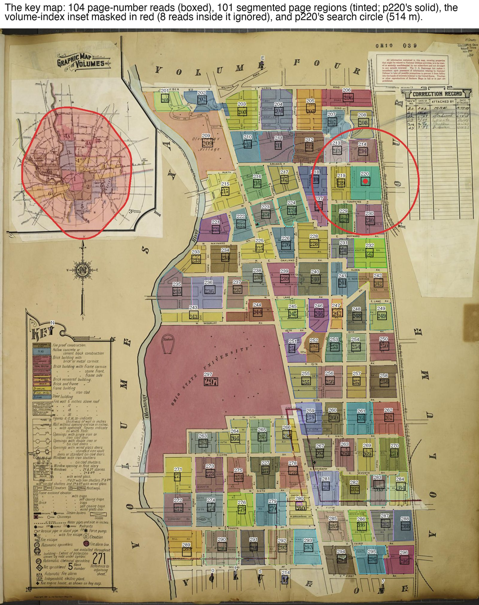

The key map is found, not declared. A candidate sheet's numbers are read back
and compared with the volume's page set: a real key map recovers 88–96% of the
volume's pages, a busy downtown page under 4%, so **coverage** identifies it
where a count of glyphs cannot (#108, #131, #141). Its page numbers are located
by a small CNN and read by a CRNN trained for the job (#81, #318); their blocks
are segmented into page regions by colour (#87, #186); and the sheet is then
georeferenced like any other page, from its own street labels, with a full
six-parameter affine because key maps are drawn with real anisotropy (#94,
#113). That gives every page number a place on the ground.

Three things on a key-map sheet are *not* pages and had to be taught: the
"graphic map of volumes" inset, whose numerals are volume numbers (#386–#388;
Richmond's p311 was published 14,713 ft away because the inset's "1" became a
search centre), the KEY legend and any second key map cut away as corner boxes
(#389), and the sheet's own cartouche words (#384). The printed adjacency
graph of step 6 repairs page numbers the CRNN misread (#217), and every
decision is logged to `raw/<stem>.keymap.txt` (#385).

From here on each page carries, in its sidecar, a **search centre and radius**
(the region's centroid; the vocabulary of step 4 is restricted to it), and a
**region scale prior**: a page whose key-map footprint is about twice the
volume's typical area was drawn at half the scale, which is how the half-scale
sheets of a volume are caught (#114, #140).

|  |  |
| --- | --- |
| Page-number reads | 104 (8 more inside the inset, ignored) |
| Page regions segmented | 101 |
| Key-map georef | 922 street labels, 1060 intersections |

### 6. Sheets that name their neighbours

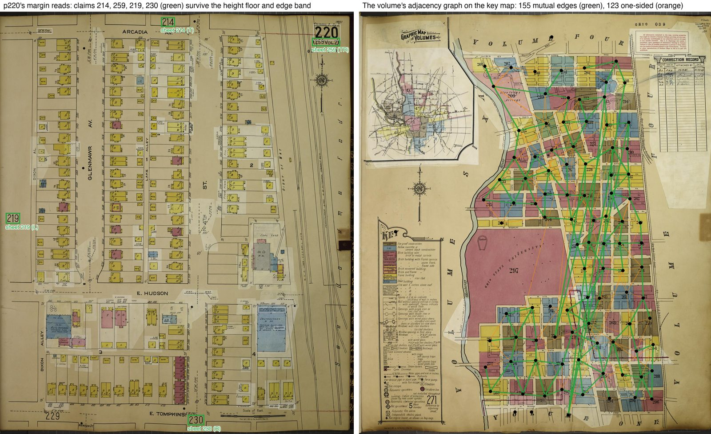

Sanborn sheets print the adjoining sheet's number across the shared boundary.
mapsnap reads those margin numerals (#110) and admits one as a **claim** only
when it resolves to a valid page key, sits in the edge band, is printed at
least as tall as the volume's own calibrated floor and is axis-aligned (#206,
#209); a mutual pair of claims is an edge that is ~100% precise. One-sided
claims form a lower-trust tier (#207), and a mutual-edge triangle or a
reciprocating multi-digit read can promote one (#356, #357). The graph
was labelled and checked in the debugger (#150, #170, #178).

Adjacency feeds four consumers: it repairs key-map page numbers (step 5), it
supplies a rotation prior to snap (a neighbour's fitted angle), it seeds
rescues with the neighbour's **stamp**, the point where its printed claim
lands through its own fit (#336), and it is the contradiction gate of step 8.

|  |  |
| --- | --- |
| Mutual edges | 155 |
| One-sided claims | 123 (41 promoted) |
| p220's claims | 214 (top), 259 (top right), 219 (left), 230 (bottom) |

---

## IV. Fitting a page

### 7. Label axes, intersections and RANSAC

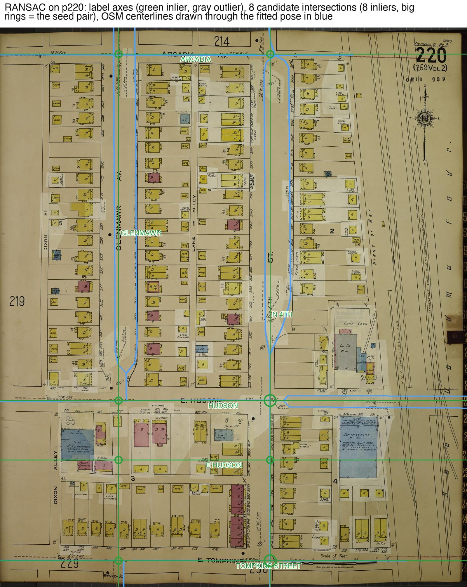

A street name is set along its street, so the long axis of each read is
extended into a line across the page. Where two lines cross, the pair of names
is looked up in OSM; every crossing that exists on the modern map becomes a
candidate ground control point. RANSAC then tries seed pairs, ranked by a
consensus score rather than at random (#101), fits a pose from each and counts
the labels that land on their street at the right angle. Six parameters are
fitted (the scan may be anisotropic) but the published transform is the
four-parameter Helmert the inliers support (#48; see the README's "Six
parameters vs. four").

The volume then sets the page straight. A page with a single usable crossing is
placed anyway, at the volume's reference scale, with its rotation from the
labels (#97, #49). A fit whose scale is a factor of two off the volume's is
snapped to the nearest **rung** (50, 100, 200 ft per inch; #114, #140), with
the printed scale note as an absolute authority where it was read (#197, #201,
#204). Near-tie poses are kept as runner-ups for the later stages (#341).

|  |  |
| --- | --- |
| p220 | 8 candidate intersections, 8 inliers; 6 of 7 labels agree |
| Volume | RANSAC over all 106 pages in 28 s; 99 carry a published pose at the end |

### 8. The adjacency gate

Both sides of every mutual edge are mapped through their own fits. If the two
stamps land more than 100 m apart (widened for coarser sheets, #262) the edge
is a contradiction, and the gate names a suspect: a page contradicting two or
more neighbours, or one nobody vouches for, or the one with fewer control
points (#208). A named page is demoted only with a hard signal, few GCPs or a
rotation far from the volume's median, and its partners' stamps are handed to
the next stage as extra search centres. On Columbus no page was demoted.

### 9. P(road): a picture of the streets

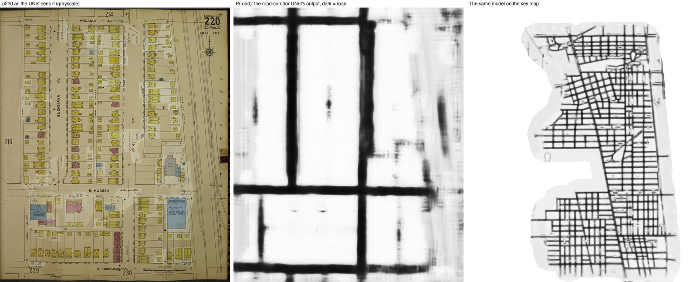

Everything so far ran on names. The next stage runs on ink. A small UNet turns
a page into a **road-probability map**: it was trained on free labels, OSM
centerlines drawn through pages the name channel had already fitted (#125),
resampled uniformly so wide streets and alleys both count (#348), and
recalibrated in its fourth version (#350). A colour variant does the same for
key maps, whose streets are paper-coloured gaps between painted blocks (#211,
#225; that matcher is an experiment, not part of the production fit).

### 10. snap: matching geometry, not names

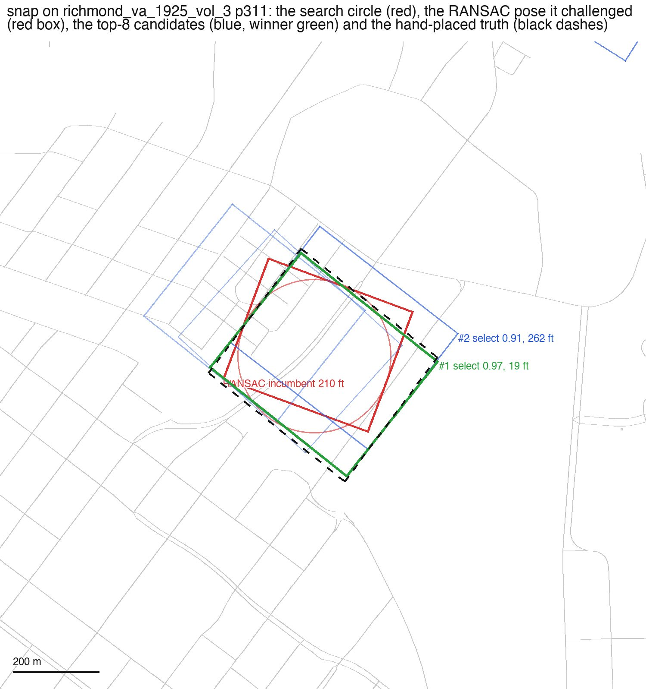

`snap` places a page by correlating its P(road) map against OSM centerlines
rasterized at the same scale (#152). It searches a **rotation ladder** built
from the page's own evidence: the angles of label pairs that matched exactly,
labels against their OSM street modulo 180°, the neighbour's fitted angle, the
volume's median, plus a sweep at 90° steps; and the volume's **scale rungs**,
including the page's own fitted rung (#371) and the printed note's (#201). Each
rung is one masked normalized-cross-correlation pass; the top peaks are refined
by chamfer matching of the road skeleton, sliding at most 30 m; and each
candidate is scored:

```
verification = inlier_frac + ncc_fine − chamfer_mean_m / 30
select       = verification + name_evidence + 0.3 · region_containment + rotation-prior term
```

`name_evidence` is signed: street names that match nothing under the pose
count against it (#376). What happens next depends on the page's state:

- **Rescue** (the page is unplaced): the top candidate publishes if
  `select ≥ 1.35` and its margin over the runner-up is `≥ 0.25`; a candidate
  that puts a demoted page's printed claim back on its neighbour's stamp gets
  in at 0.7 (#336).
- **Challenge** (the page has a fit the candidate disagrees with by ≥ 100 ft):
  the candidate needs `select ≥ 1.6`, the margin, better verification and name
  parity, *and* an incumbent that is geometrically indefensible
  (verification < 0.1).
- **Refine** (they agree within 100 ft): the chamfer-locked pose replaces the
  incumbent when its verification is better by 0.05 and the incumbent had at
  least two effective control points (#280).

The figure is the rescue Richmond p311 got on 2026-09-03: RANSAC had placed it
210 ft off (red), the search circle came from the corrected key map (#386), and
the winning candidate (green, 19 ft) outscored a plausible alias two blocks
west (blue, 262 ft) on name evidence.

The honest counterexample is Columbus p220 itself. Its record shows a
challenge that fell to a refine, and the refine adopted candidate #1, whose
rotation came from the adjacency prior, at 27 ft, over candidate #2 at 14 ft
and an incumbent at 20 ft, on a margin of 0.0001:

| rule | need | got | verdict |
| --- | --- | --- | --- |
| challenge/select | ≥ 1.6 | 2.291 | pass |
| challenge/margin | ≥ 0.25 | 0.0001 | fail |
| challenge/disagreement | ≥ 100 ft from the incumbent | 32.7 ft | fail |
| challenge/incumbent-indefensible | incumbent verification < 0.1 | 1.193 | fail |
| refine/verification-margin | > incumbent + 0.05 | 1.324 vs 1.193 | pass |
| refine/agreement | < 100 ft | 32.7 ft | pass |

Every record carries this table, the priors it searched from, and the truth
pose scored by the same evidence, so the debugger can say whether the search
never reached the right pose or the evidence preferred a wrong one (#370,
#391). The rescue bars, margins and the refine rule were each swept on the
region-graded metric before they were fixed (#161, #195, #198).

|  |  |
| --- | --- |
| Columbus | 247 s; 53 incumbents kept, 35 refinements, 1 challenge, 7 abstains |
| Richmond p311 | 14,713 ft (2026-08-28) → 210 ft RANSAC → 19 ft snap |

### 11. street-solve: labels as constraints

RANSAC needs two readable streets to *cross*. Many pages never give it one:
their labels run parallel, or the crossing is off the sheet. But a label alone
says two things, where its street is and which way it runs, and two distinct
parallel streets fix rotation and, from their spacing, scale. `street-solve`
fits a pose from those constraints against named OSM polylines, without any
intersection (#175, #189; batched consensus scoring in #339). On its own the
channel is a coin flip, so its pose is adopted only where an independent
referee, snap's `evaluate_pose` on the road skeleton, prefers it over the
published pose by a clear margin.

### 12. reconcile: one arbiter for every pose

Until #270 the stages published by precedence: each gate hid its
predecessors' files, and no step ever compared two candidate poses for the
same page. `reconcile` replaces that with a joint decision per volume (#286
report-only, #293, #297 publishing, #314 retiring the gates it made
redundant). For every page it collects every pose any channel produced,
**including the ones the channel itself declined**, the top snap candidates,
the street-solve pose and the option of leaving the page unplaced, scores each
with the same road-skeleton and name evidence plus terms for control-point
count, distance from the key-map location and scale rung, and adds pairwise
factors for the adjacency stamps and page overlaps. The minimum-energy
assignment is written to `p*.georef-final.json` for **every** page; a page the
arbiter declines gets one with `corners: null`, so not placing a page is a
recorded decision rather than a missing file.

---

## V. Publishing and grading

### 13. The IIIF annotation page and its masks

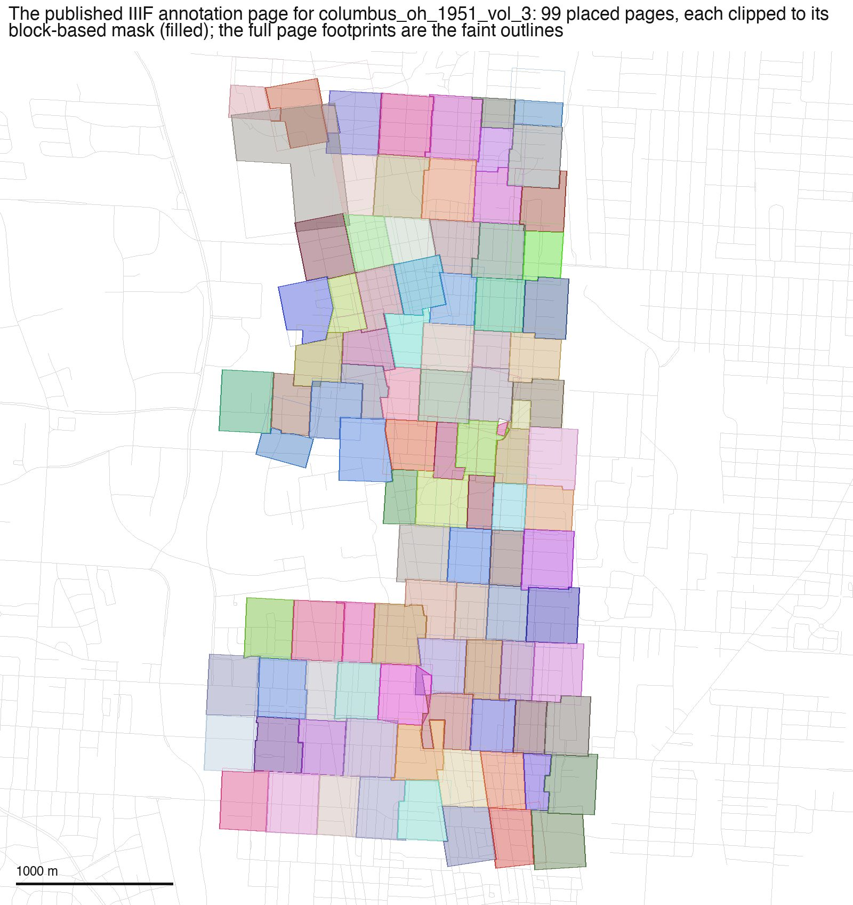

`mapsnap iiif` expands one glob, `*.georef-final.json`, and writes a IIIF
Georeference Annotation page: for each placed page its image service, the
control points (the two RANSAC seeds as a Helmert transform where they exist,
four corner points as a first-order polynomial otherwise; #48), and a clipping
mask. Masks are built block by block from the street grid: every OSM block is
given to the one page that draws it in the most colour, so overlapping margins
disappear and the mosaic tiles without seams (#31; sliver-proofing in #224,
#364; labels and split markers in #381). The result opens directly in Allmaps
and in the repo's own viewer (#123, #137, #158). A multi-volume run stitches
annotation pages together (#39).

### 14. Grading against hand-placed truth

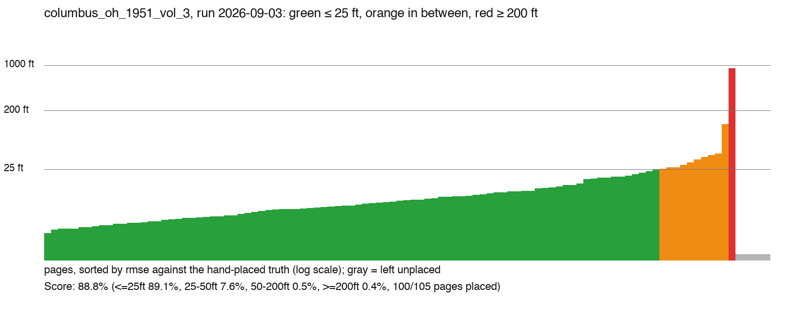

`mapsnap compare` grades each placed page against its OldInsuranceMaps
placement over a grid of points inside the **truth page's own footprint**, and
a split sheet is graded panel by panel over each panel's region (#160, #200;
the truth panels come from OIM's region boundaries, #274, #310). `mapsnap
score` then folds the volume into one number (#148, #199, #300, #338):

> **score** = land-weighted share of the volume's sheets placed within 25 ft
> − land-weighted share placed 200 ft or worse.

Every sheet weighs the same, split across its panels by paper area and
discounted by the share of the sheet that is land (proximity to an OSM
street), so a downtown sheet counts more than a harbour one and unplaced
sheets count against coverage without being punished as errors. The corpus
number is the mean over the 20 truth volumes; runs are compared with
`mapsnap experiments diff` and recorded under `baselines/` (#360, #396).

|  |  |
| --- | --- |
| Columbus 2026-09-03 | **88.8** (≤25 ft 89.1%, 25–50 ft 7.6%, 50–200 ft 0.5%, ≥200 ft 0.4%, 100/105 placed) |
| Corpus, 20 volumes | mean **80.4** |

### 15. What is left on the table

The archived candidates say how much better selection alone could do. Across
the 2026-09-03 run, 79% of the pages that reached snap hold a ≤25 ft pose in
their top eight candidates, almost always at rank 1. An oracle choosing the
best of the incumbent and those eight would score 83.8 against 80.4; 72 pages
(4%) are rescuable, and for 60% of them the good candidate was ranked first and
a gate said no. That is the next problem (`baselines/2026-09-03.md`).

---

## Glossary

**page / panel** — one scan, or one of the map panels cut from it; the unit
everything works on
**volume** — one bound atlas; the source of the scale rungs, the median
rotation and the key map
**key map** — the sheet that indexes the volume; read for page numbers and
georeferenced itself
**claim** — a margin numeral admitted as naming an adjoining sheet
**stamp** — where a claim lands on the ground through its page's fit
**GCP** — a control point: a street crossing found on both the page and OSM
**deferred / 1-GCP** — a page placed from one crossing at the volume's scale
**rung** — one of the volume's printed scales, 50/100/200 ft to the inch
**P(road)** — the UNet's road-probability map of a page
**rescue / challenge / refine** — snap's three outcomes: place an unplaced
page, replace a disagreeing fit, tighten an agreeing one
**arbiter** — `reconcile`, which weighs every pose jointly and publishes
**score** — %≤25 ft − %≥200 ft, land-weighted, per volume

## Regenerating the figures

```sh
uv run python scripts/how_it_works_figures.py --tag 2026-09-03
```

Input is the volume under gitignored `data/` and its archived run; output is
tracked under `images/how-it-works/`. The script pins the volume and pages it
draws; edit it to follow another run.

Scans: Library of Congress, Sanborn Fire Insurance Map Collection; hand
placements: OldInsuranceMaps.net volunteers; street centerlines: OpenStreetMap.
